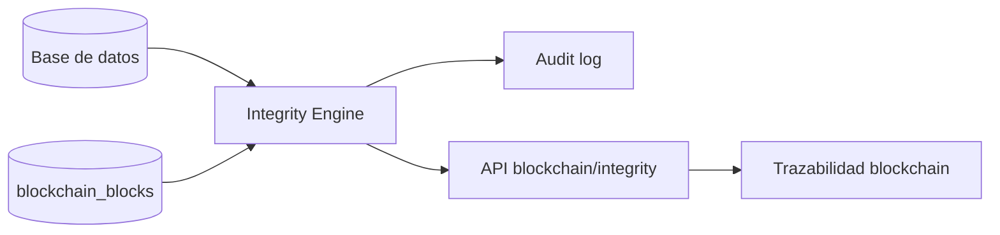

# FIDUCIA - Blockchain Integrity Verification

## Objetivo

Blockchain Integrity Verification compara el estado actual de una remesa en base de datos contra la evidencia criptografica registrada en la cadena local de FIDUCIA. Su objetivo es detectar modificaciones directas posteriores en BD sin alterar Risk Engine, ML, forecasting, BI ni decisiones operativas.

## Arquitectura



FIDUCIA utiliza una cadena local con bloques enlazados por `previous_hash`, prueba de trabajo simple y evidencia SHA-256. La blockchain no guarda datos personales sensibles ni informacion bancaria; guarda hashes, referencias tecnicas y metadatos de evento.

## Campos protegidos

Las remesas nuevas usan `remittance-evidence-v2`. Los campos protegidos son:

- `schema_version`
- `event_type`
- `entity_type`
- `entity_reference`
- `sender_id`
- `beneficiary_id`
- `beneficiary_user_id`
- `funding_source_id`
- `remittance_number`
- `origin_country`
- `destination_country`
- `source_currency`
- `destination_currency`
- `source_amount`
- `commission_amount`
- `exchange_rate`
- `total_amount`
- `debit_amount`
- `debit_currency`
- `destination_amount`
- `payment_method`
- `delivery_method`
- `status`
- `occurred_at`

La evidencia `remittance-evidence-v1` se mantiene compatible para bloques creados antes de esta ampliacion.

## Canonicalizacion y hash

La canonicalizacion usa JSON determinista con orden estable de propiedades, normalizacion de decimales y fechas UTC sin microsegundos. El algoritmo de hash es `SHA-256`.

## Estados

- `VERIFIED`: el hash calculado coincide con el registrado.
- `INTEGRITY_MISMATCH`: la remesa existe en BD y blockchain, pero los hashes no coinciden.
- `BLOCKCHAIN_RECORD_MISSING`: la remesa existe en BD, pero no tiene evidencia blockchain aunque ya deberia tenerla.
- `DATABASE_RECORD_MISSING`: existe evidencia blockchain, pero no existe el registro de remesa en BD.
- `LEGACY_NOT_PROTECTED`: remesa anterior a evidencia blockchain verificable.
- `CHAIN_BROKEN`: la cadena local tiene hashes, enlaces o prueba de trabajo inconsistentes.
- `VERIFICATION_ERROR`: error tecnico; no debe interpretarse como fraude ni manipulacion.

## API

- `GET /api/v1/blockchain/integrity/transactions/{remittance_id}`
- `POST /api/v1/blockchain/integrity/verify`
- `GET /api/v1/blockchain/integrity/status`

Clientes solo pueden verificar remesas propias. `ADMIN` y `RISK_ANALYST` pueden consultar la integridad general.

## Auditoria

Cuando se detecta `INTEGRITY_MISMATCH`, FIDUCIA registra un evento `BLOCKCHAIN_INTEGRITY_MISMATCH` en `audit_logs` con:

- ID tecnico de remesa.
- Hash registrado.
- Hash calculado.
- Fecha de deteccion.
- Fuente de verificacion.
- Usuario que ejecuto la verificacion, si existe.

No se modifica la remesa original.

## Limitaciones

La cadena conserva hashes, no snapshots completos de los valores originales. Por eso, cuando existe un mismatch, FIDUCIA puede demostrar que la informacion actual fue alterada, pero no siempre puede indicar que campo exacto cambio. Para identificar diferencias campo por campo se requiere un snapshot seguro adicional en una version futura.

## Demostracion controlada en desarrollo

1. Crear una remesa desde la aplicacion o Swagger.
2. Confirmar que tiene evidencia:

```sql
SELECT block_index, event_type, entity_reference, evidence_hash
FROM blockchain_blocks
WHERE entity_type = 'remittance' AND entity_reference = 'ID_INTERNO';
```

3. Ejecutar verificacion:

```http
GET /api/v1/blockchain/integrity/transactions/ID_INTERNO
```

Resultado esperado: `VERIFIED`.

4. En local/test, modificar directamente un campo protegido:

```sql
UPDATE transactions
SET source_amount = 5000.00
WHERE id = ID_INTERNO;
```

5. Ejecutar nuevamente la verificacion.

Resultado esperado: `INTEGRITY_MISMATCH`.

6. Restaurar el dato:

```sql
UPDATE transactions
SET source_amount = 500.00
WHERE id = ID_INTERNO;
```

7. Ejecutar nuevamente.

Resultado esperado: `VERIFIED`.

## Recuperacion ante inconsistencia

1. Preservar la evidencia y el audit log.
2. Validar si el cambio fue operativo, accidental o malicioso.
3. Restaurar el dato legitimo desde respaldos o bitacoras autorizadas.
4. Ejecutar `POST /api/v1/blockchain/integrity/verify`.
5. Documentar la resolucion en auditoria operativa.
